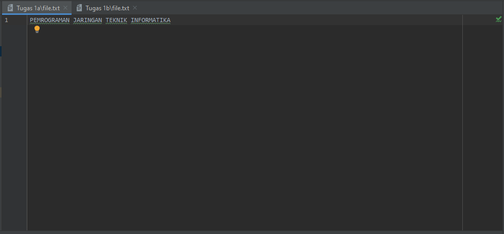
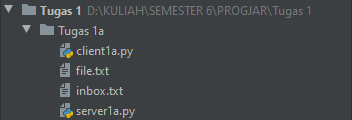
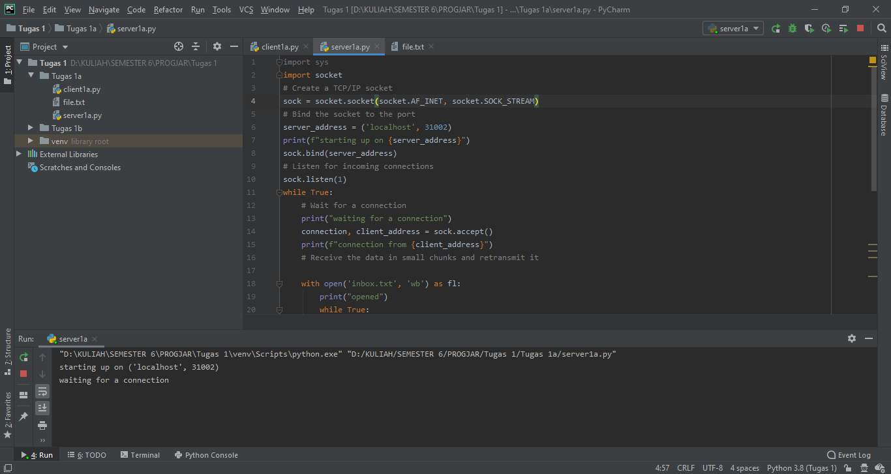
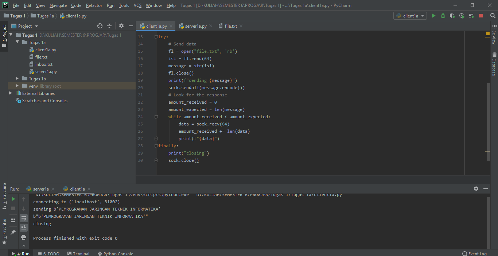

## Tugas 1
## 1a. memodifikasi program client.py dan server.py agar dapat mentransfer file dari client ke server
1. membuat file 

2. sebelum di eksekusi

3. Menjalankan server

4. Menjalankan client

