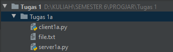
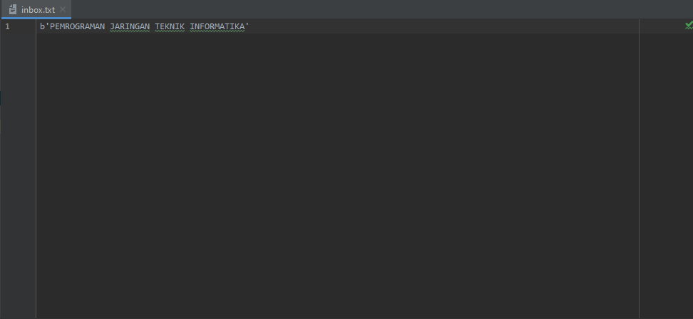
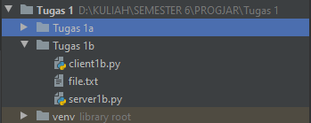
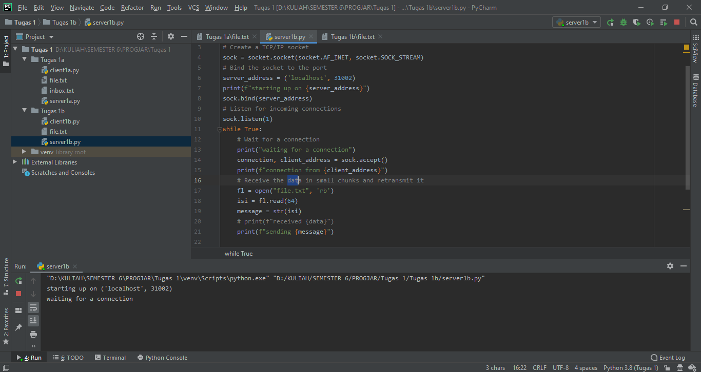
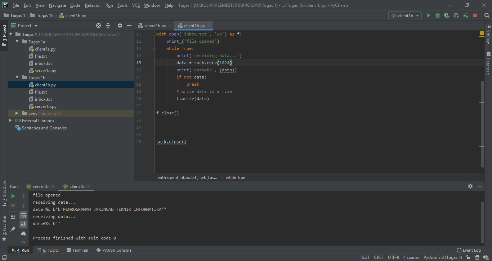

## Tugas 1
## 1a. memodifikasi program client.py dan server.py agar dapat mentransfer file dari client ke server
1. membuat file.txt yang berisikan pesan yang akan dikirim

2. sebelum di eksekusi

3. Menjalankan server

4. Menjalankan client

5. Setelah di eksekusi

6. akan terdapat file inbox, yang berisikan file yang dikirim dari client

## 1b. memodifikasi program server.py agar dapat mentransfer file yang direquest oleh client

1. membuat file.txt yang berisikan pesan yang akan dikirim

2. sebelum di eksekusi

3. Menjalankan server

4. Menjalankan client

5. Setelah di eksekusi

6. akan terdapat file inbox, yang berisikan file yang dikirim dari client

