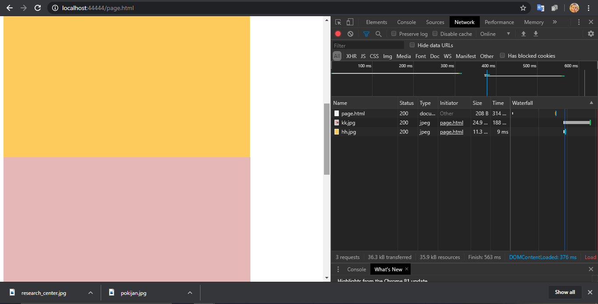

# Tugas 10

Lapran di file Tugas10_Risky Aswi Narni_05111740000014.pdf

Jalankan async_server.py pada port 9002, 9003, 9004, 9005 (lihat pada BackendList)

Jalankan file lb.py, jalankan di port 44444

Jalankan browser, akseslah http://localhost:44444/page.html

Lihatlah di log program, bahwa setiap request akan dilayani oleh backend yang bergantian

Tabel pembanding dengan async_server dengan server_thread_http dengan Asyncronus Server Dengan Load Balance

 

Hasil SS performance test Asyncronus Server Dengan Load Balance
- ab -n 1000 -c 1 -r http://127.0.0.1:44444/

- ab -n 1000 -c 10 -r http://127.0.0.1:44444/

- ab -n 1000 -c 50 -r http://127.0.0.1:44444/

- ab -n 1000 -c 100 -r http://127.0.0.1:44444/

- ab -n 1000 -c 150 -r http://127.0.0.1:44444/

