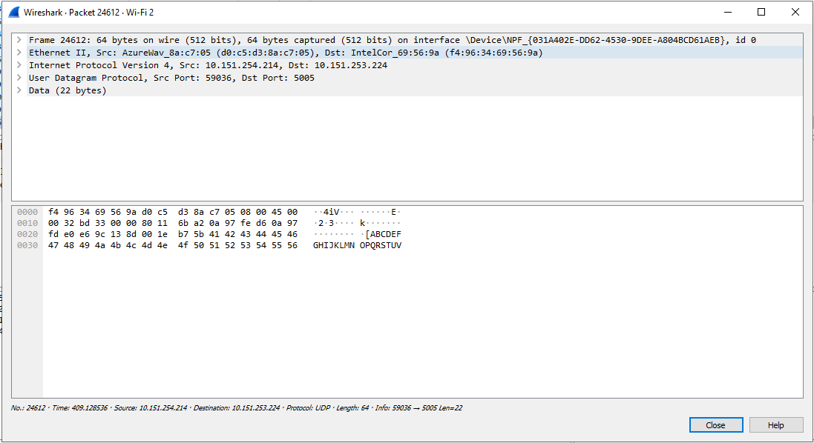
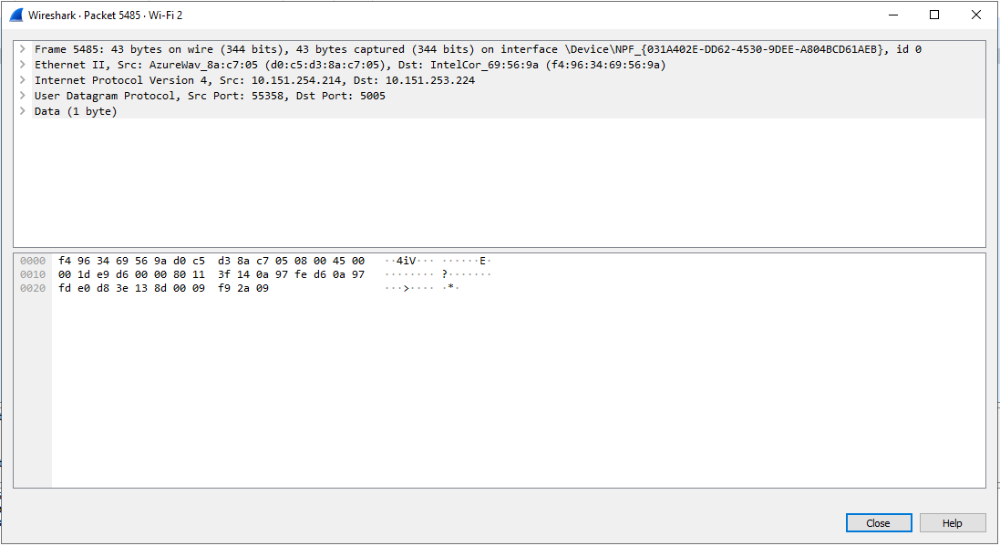

## Tugas 2

Menjalankan program dengan 
pc saya -> 10.151.254.214
pc lain -> 10.151.253.224
filter wireshark dengan

Menjalankan udp_simple dari pc saya ke pc lain dengan
pesan yang dikirimkan "ABCDEFGHIJKLMNOPQRSTUV"

Menjalankan udp_fileclient dari pc saya ke pc lain dengan
file yang dikirimkan adalan "bart.png"

