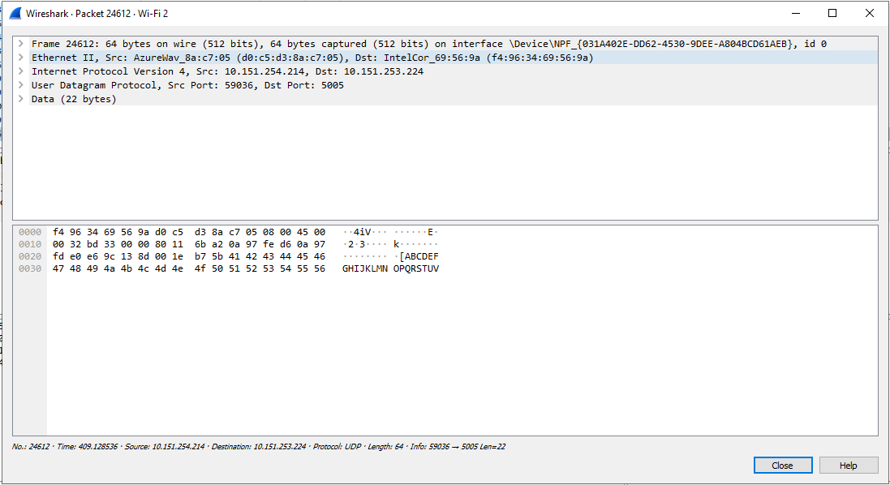
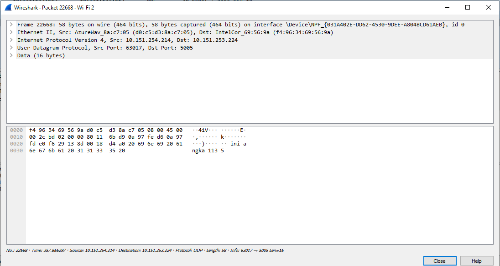

## Tugas 2

Menjalankan program dengan 
ip 10.151.154.214 dan pc lain yang memiliki ip 10.151.253.224

filter wireshark dengan

Menjalankan udp_simple dengan pesan yang dikirimkan "ABCDEFGHIJKLMNOPQRSTUV"
Menjalankan program dengan 
ip 10.151.154.214 dan pc lain yang memiliki ip 10.151.253.224

Menjalankan udpclient  dengan file yang dikirimkan adalah "ini angka {}"
Menjalankan program dengan 
ip 10.151.154.214 dan pc lain yang memiliki ip 10.151.253.224

Menjalankan udp_fileclient  dengan file yang dikirimkan adalan "bart.png"
Menjalankan program dengan 
ip 10.151.154.214 dan pc lain yang memiliki ip 10.151.253.224

----------------------------------------------------------------------------------------------------

Menjalankan program dengan 
ip 127.0.0.1

filter wireshark dengan

Menjalankan udp_simple dengan pesan yang dikirimkan "ABCDEFGHIJKLMNOPQRSTUV"

Menjalankan udpclient  dengan file yang dikirimkan adalah "ini angka {}"

Menjalankan udp_fileclient  dengan file yang dikirimkan adalan "bart.png"

