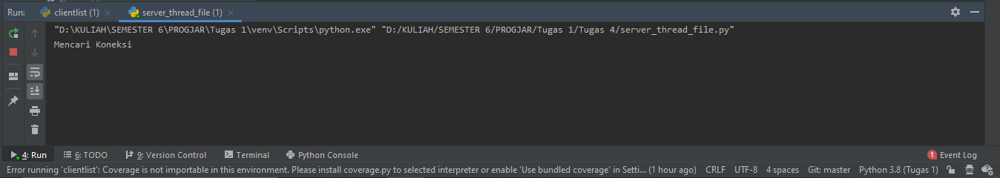
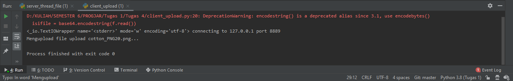
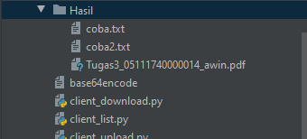
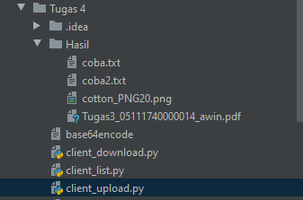
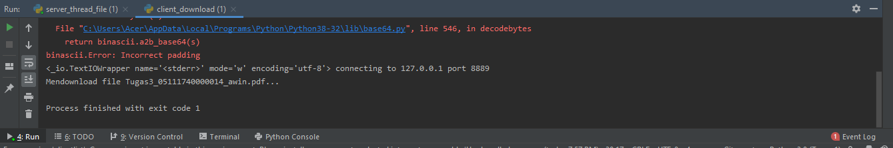
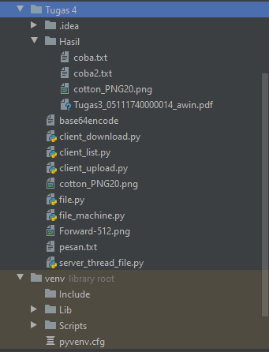
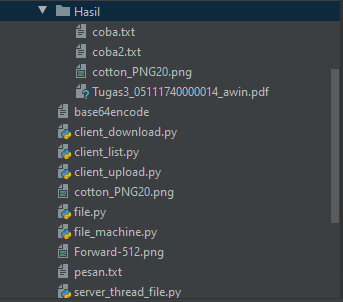
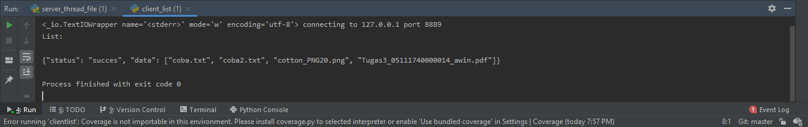
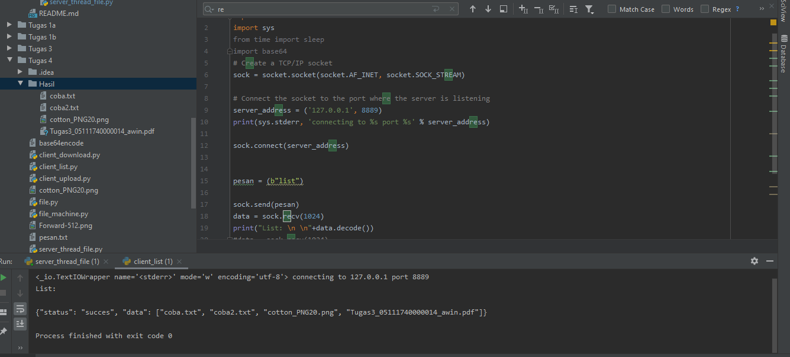

# TUGAS4
## 1. Client untuk oprasi meletakkan file(upload)

-Menjalankan server

-Menjalankan client_upload.py

-Sebelum dieksekusi

Diketahui bahwa saya akan mengupload file cotton_PNG20.png yang terdapat diluar direktori hasil

-Setelah eksekusi

Terdapat cotton_PNG20.png di dalam direktori Hasil

## 2. Client untuk operasi mengambil file(download)

-Menjalankan server

-Menjalankan client_download.py

-Sebelum dieksekusi

Diketahui bahwa saya akan mendownload file Tugas3_05111740000014_awin.pdf yang terdapat di direktori hasil

-Setelah eksekusi

Akan terdapat file Tugas3_05111740000014_awin.pdf yang terdapat diluar dari direktori hasil

## 3. Client untuk operasi melihat list file

-Menjalankan server

-Menjalankan client_list

Diketahui bahwa list akan melihat file file yang ada di direktori Hasil

