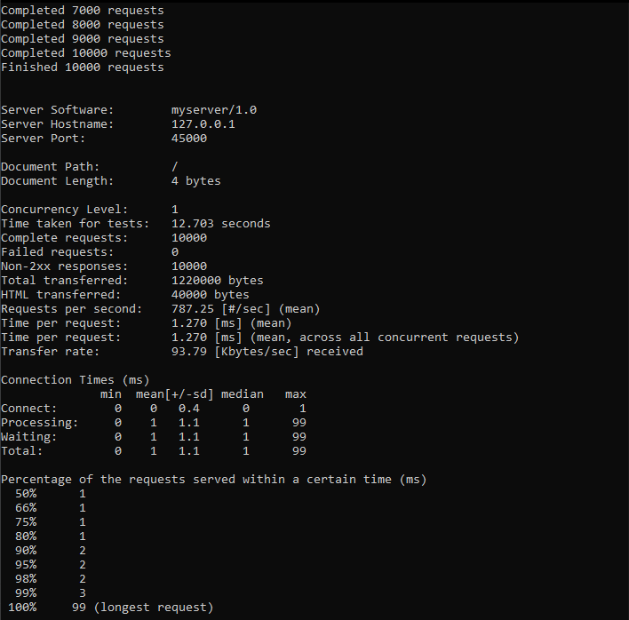
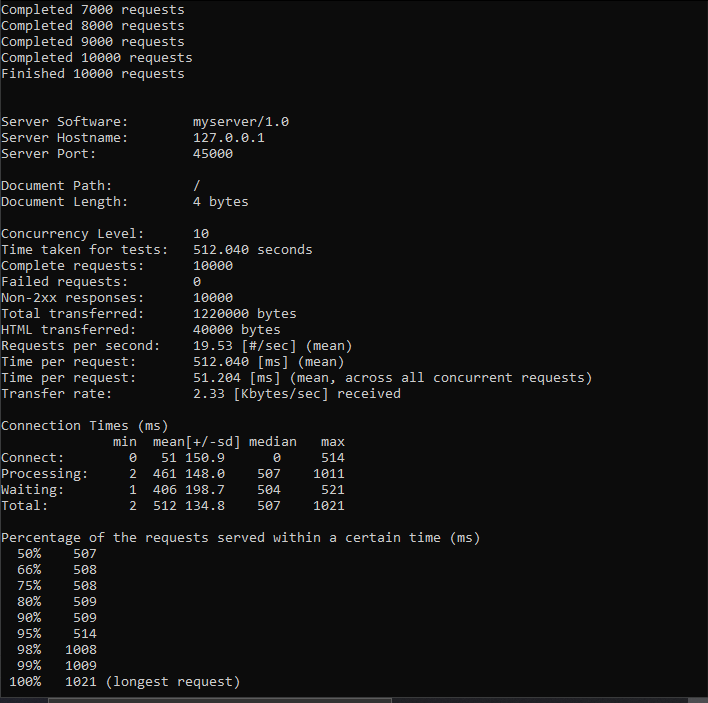
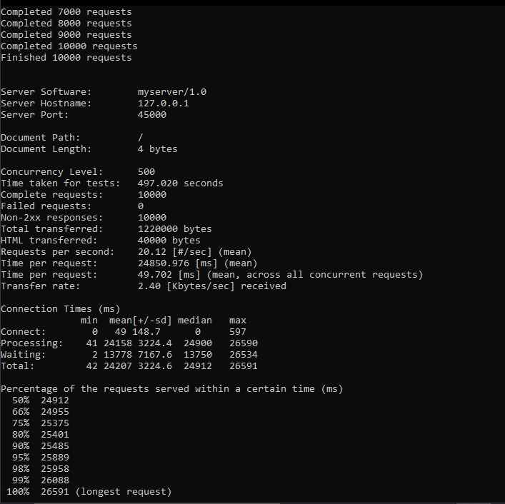
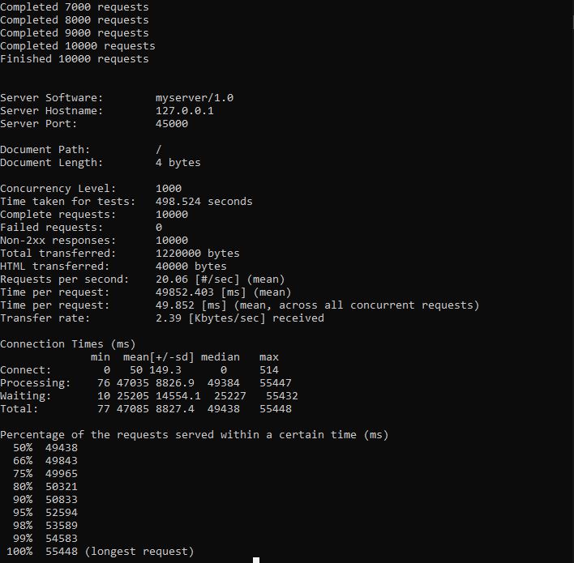

tugas 9
SS hasil bash

server_async_http.py

ab -n 10000 -c 1 -r http://127.0.0.1:45000/

ab -n 10000 -c 10 -r http://127.0.0.1:45000/

ab -n 10000 -c 100 -r http://127.0.0.1:45000/

ab -n 10000 -c 500 -r http://127.0.0.1:45000/

ab -n 10000 -c 1000 -r http://127.0.0.1:45000/

