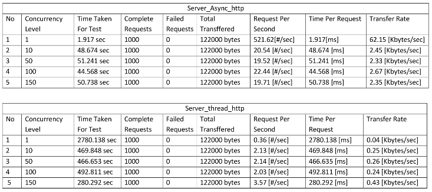
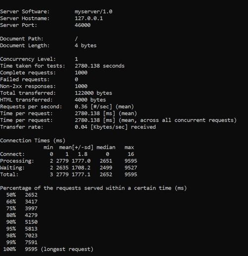
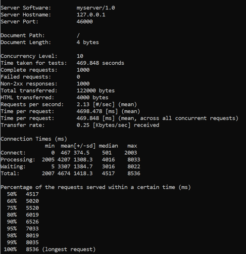
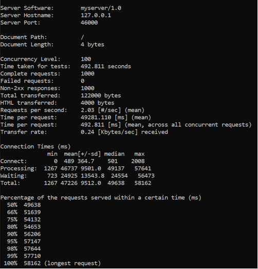
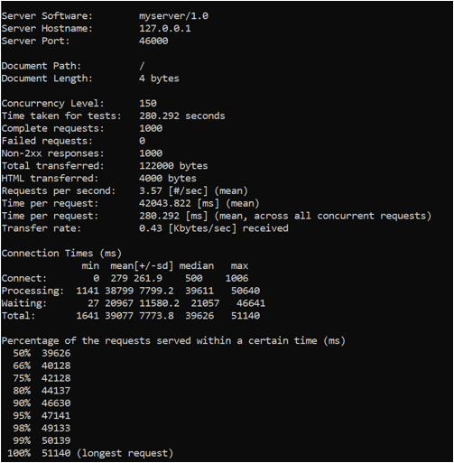

# Tugas 9

Laporan : Tugas9_Risky Aswi Narni_05111740000014.pdf

SS hasil

- server_async_http.py

ab -n 1000 -c 1 -r http://127.0.0.1:45000/

ab -n 1000 -c 10 -r http://127.0.0.1:45000/

ab -n 1000 -c 50 -r http://127.0.0.1:45000/

ab -n 1000 -c 100 -r http://127.0.0.1:45000/

ab -n 1000 -c 150 -r http://127.0.0.1:45000/

- server_thread_http.py

ab -n 1000 -c 1 -r http://127.0.0.1:46000/

ab -n 1000 -c 10 -r http://127.0.0.1:46000/

ab -n 1000 -c 50 -r http://127.0.0.1:46000/

ab -n 1000 -c 100 -r http://127.0.0.1:46000/

ab -n 1000 -c 150 -r http://127.0.0.1:46000/

